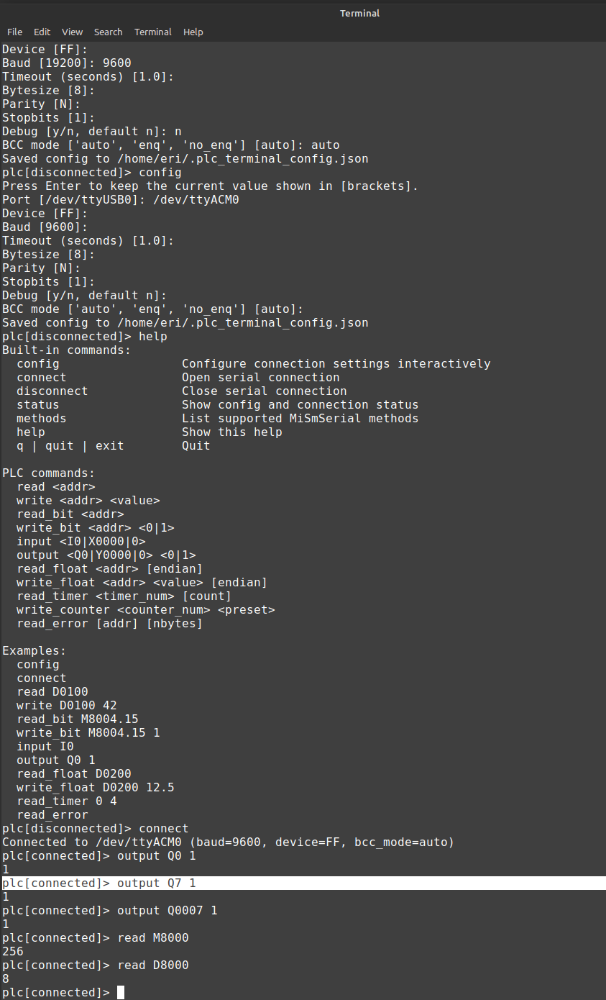

# IDEC-TUI
An interactive termnial for commanding your IDEC PLC.  
 
Terminal features would be nice right? 
Well it is an interactive shell, and it could be improved.  

  
<b>Notes:</b> 

history would be rad.
lshw -- list hardware
check -- or whatever I might call it, integrate the diagnostic tool I made this weekend
